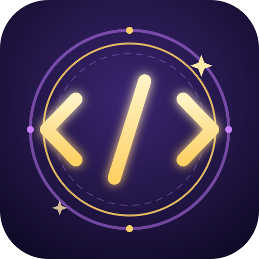

# ⚔ Codex Arcanum

> **League of Legends encontra-se com um editor de código.** Um jogo de dueltos mágicos 1v1 onde os feitiços são **programas JavaScript escritos por ti** — e a melhor forma de aprender a programar é ganhar duelos.



**Feitiço = código.** Não há feitiços fixos: cada magia é uma função que tu escreves num editor com autocomplete, testas contra um bot e levas para duelos online autoritativos contra outros magos.

```js
feitico.definir({
  nome: "Lança Tripla",
  elemento: "fogo",
  custoMana: 30,
  recarga: 2.5,
  aoLancar(ctx) {
    for (let i = -1; i <= 1; i++) {
      ctx.invocar({
        tipo: "projetil",
        direcao: ctx.anguloParaInimigo() + i * 0.25,
        velocidade: 9 * 50,
        dano: 8,
        aoAcertar(alvo) {
          alvo.aplicar("queimadura", { dps: 2, duracao: 3 });
        },
      });
    }
  },
});
```

## ✨ O que está implementado

- **Sandbox de feitiços** — interpretador instrumentado com limite de passos por lançamento (ciclos infinitos não crasham o jogo), sem acesso a DOM/rede/ficheiros, com erros temáticos: *«O teu grimório estalou: falta fechar uma chaveta `}` na linha 4»*.
- **Arena 2D top-down** — WASD + rato + teclas 1–6, dash com cooldown, escudos que quebram, **projéteis que colidem entre si (parry mágico)**.
- **Elementos e sinergias** — fogo, água, terra, ar, arcano (fogo + molhado = vapor que cega; fogo + vento = explosão ampliada).
- **Academia (PvE)** — 8 capítulos: funções → variáveis → condicionais → ciclos → funções próprias → vetores/trigonometria (mira preditiva) → eventos → otimização. Cada lição tem **verificação automática** (análise AST + simulação real) e desbloqueia componentes novos.
- **Polígono de Treino** — bot com IA (aproxima-se, dispara, esquiva, desvia de obstáculos) para testares feitiços sem sair do jogo (escrever → testar → ajustar).
- **Duelo online 1v1** — servidor **autoritativo** (Node.js + Socket.IO): o código dos feitiços é validado e executado **só no servidor**; clientes enviam intenções de input e recebem snapshots a 20 Hz com interpolação.
- **Progressão** — XP/níveis, desbloqueio de componentes (`projetil`, `feixe`, `area`, `escudo`, `dash`, `teleporte`, `armadilha`, `aura`), rating **Elo** com ligas (Aprendiz → Mago → Arquimago → Lenda Arcana).
- **Grimório** — cria, equipa (6 slots + orçamento de *energia arcana*), exporta e importa feitiços em JSON.
- **Juice** — partículas, screen shake, números de dano, áudio sintetizado (WebAudio, zero assets) e ícone próprio.

## 🚀 Jogar

**Online (multiplayer):** abre o URL do deployment — ver [Deploy](#-deploy) abaixo.

**Local (dev):**

```bash
npm install
npm run dev        # cliente (Vite :5173) + servidor (:3000) em simultâneo
```

Abre `http://localhost:5173`. Para testar o multiplayer sozinho: abre duas janelas do browser, entra no lobby **Duelo** em ambas e procura um duelo casual.

**Produção num só serviço:**

```bash
npm install
npm run build      # compila o cliente para client/dist
npm start          # servidor serve o cliente + Socket.IO na porta 3000
```

## 🧪 Testes

```bash
npm test
```

Valida: compilação de feitiços, erros temáticos, limite de passos (ciclos infinitos), magia proibida (`eval`), **determinismo da simulação** (mesma semente → mesmo resultado), partida bot vs bot completa e os **8 exemplos da Academia** a passar os seus próprios testes.

## 📦 Estrutura (monorepo)

```
codex-arcanum/
├── client/    # Vite + Canvas 2D + Monaco (editor) + Socket.IO client
│   └── src/
│       ├── jogo/        # controlos (WASD/rato) e sessões local/online
│       ├── render/      # renderizador da arena, partículas, juice
│       └── ui/          # menus, academia, grimório, editor, HUD
├── server/    # Node + Express + Socket.IO — autoritativo (Elo, matchmaking, validação)
├── shared/    # NÚCLEO partilhado cliente+servidor:
│   └── src/
│       ├── sandbox/     # compilador de feitiços (acorn), instrumentação, erros PT
│       ├── spells/      # API de magia (ctx, alvo)
│       ├── sim/         # simulação determinística 60 Hz + bot
│       ├── academia/    # 8 lições + verificação automática
│       └── feiticos/    # os 6 clássicos (documentação viva)
├── docs/      # referência da API de feitiços
├── scripts/   # gerador do ícone próprio (pngjs, sem dependências nativas)
└── tests/     # testes de núcleo
```

Comentários de código em português. Tudo open-source (MIT), sem dependências pagas.

## 🎮 Controlos

| Tecla | Ação |
|---|---|
| `WASD` | mover |
| Rato | mirar |
| `1`–`6` | lançar feitiço do slot (clique esquerdo = slot 1) |
| `Espaço` | dash |
| `ESC` | sair da arena |

## 📚 Aprender

A [referência da API de magia](docs/API_FEITICOS.md) documenta cada componente e hook — mas a melhor rota é começar na **Academia**: os 6 feitiços clássicos do teu loadout inicial são programas reais que podes abrir no Grimório e editar.

## 🌍 Deploy

### Opção A — Render (serviço único, recomendado)

Serve o cliente e o Socket.IO da mesma origem — zero configuração de CORS:

1. Cria um **Web Service** no [Render](https://render.com) apontando ao repositório.
2. Build: `npm install && npm run build` · Start: `npm start` · Plano free serve.
   (Ou usa o `render.yaml` incluído com *Blueprint*.)
3. Abre `https://<teu-app>.onrender.com` — pronto a duelar.

### Opção B — Cliente na Vercel + servidor no Render

1. Deploy do servidor no Render (opção A).
2. Na Vercel, importa o repositório com **Root Directory = `client`** (framework Vite detectado).
3. Env var `VITE_SERVIDOR_URL = https://<teu-app>.onrender.com` no projeto Vercel.
4. O cliente liga ao servidor por WebSocket automaticamente.

> Nota: a Vercel serverless não suporta Socket.IO estável — por isso o servidor multiplayer vive no Render.

### Publicar no GitHub

```bash
git init && git add -A && git commit -m "Codex Arcanum v0.1"
git remote add origin https://github.com/<utilizador>/codex-arcanum.git
git push -u origin main
```

## ⚠️ Limitações conhecidas

- O rating ranqueado persiste em `server/data/elo.json` — no plano free do Render o disco é efémero (reinícios repõem ratings; os perfis pessoais vivem no `localStorage` do jogador).
- A sandbox do cliente (treino offline) esconde globals por sombreamento de parâmetros; a sandbox do **servidor** é a mesma mais rejeição estática de `eval/Function/constructor/import`. Não é um isolamento tipo VM — suficiente para um jogo, não para código hostil.
- Matchmaking sem persistência de fila; sem reconexão a meio do duelo (desistência = derrota).
- `invocacao` (aliados invocados) fica para a próxima fase; `aura` e `armadilha` já funcionam.
- Sem replays (a simulação é determinística — base pronta para isso).

## 🗺 Próximos passos recomendados

1. Replays partilhando a seed + inputs (a determinismo já o permite).
2. Grimório público com avaliações (precisa de base de dados no Render).
3. Empacotamento desktop com Tauri + ícone próprio (já gerado em `client/public/`).
4. Mais mapas e modos (2v2, rei do colinas).

---

Feito com magia e `for` loops. ⚔📖
